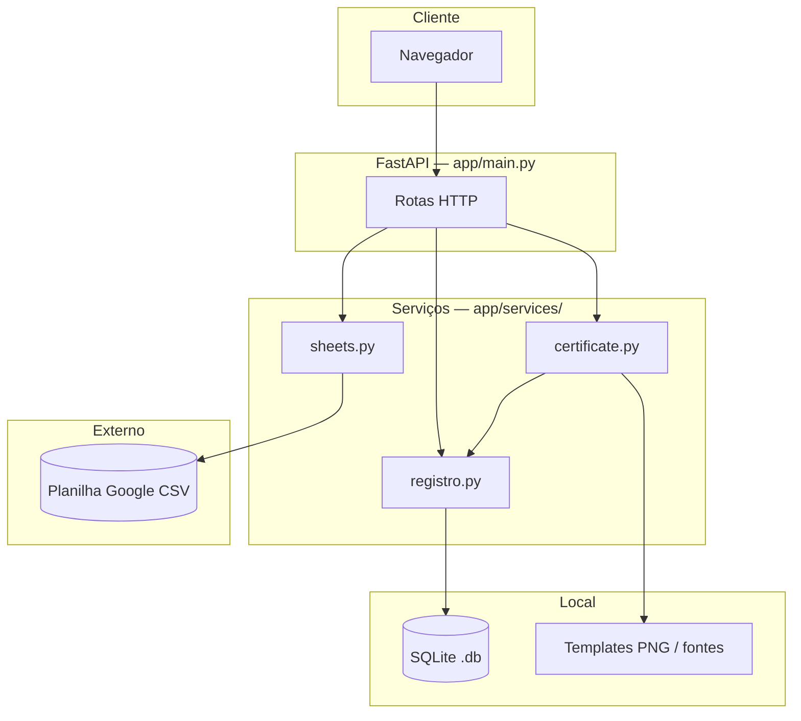

# Arquitetura — Certificados

Documento de referência para o repositório no GitHub: visão técnica do sistema, camadas e fluxos de dados.

## Visão geral

A aplicação é um **monólito web** em **Python 3** com **FastAPI**: serve **HTML/CSS/JS** estático, ficheiros em `/static` e **APIs REST** (JSON e binários). Não há SPA separada nem ORM; a persistência é **SQLite** em ficheiro local.



## Stack

| Camada | Tecnologia |
|--------|------------|
| Servidor HTTP | FastAPI, Uvicorn |
| Front-end | HTML estático + JavaScript (sem framework) |
| Estilos | CSS único (`app/static/style.css`) |
| Dados inscrições | CSV publicado (Google Sheets) via `httpx` |
| Registo de emissões | SQLite (`sqlite3`) |
| Imagem / PDF | Pillow, ReportLab, QRCode |

## Estrutura de pastas (relevante)

```
app/
  main.py              # Rotas, lifespan, montagem de /static
  static/              # Páginas HTML, CSS, templates PNG, fontes
  services/
    sheets.py          # Leitura e consulta à planilha (CSV)
    registro.py        # SQLite: códigos, validação, export, merge
    certificate.py     # Renderização PNG/PDF e QR
data/                  # certificados.db (desenvolvimento local; padrão)
```

## Camada HTTP (`app/main.py`)

- **Páginas:** `GET /`, `/validar`, `/export` → `FileResponse` para ficheiros em `app/static/`.
- **Assets:** `GET /static/*` → `StaticFiles`.
- **API pública:** eventos, template PNG, pré-visualização e PDF do certificado, validação por código (`/api/...`).
- **API administrativa:** exportação (`/api/admin/export`) e importação com merge (`POST /api/admin/import-db`), protegidas por **`CERT_EXPORT_TOKEN`** (header `Authorization: Bearer`, `X-Cert-Export-Token`, ou token em query/form).
- **Arranque:** `lifespan` chama `init_db()` para criar/atualizar o esquema SQLite.

## Serviços de domínio

### `sheets.py`

- Fonte de **inscrições e metadados de eventos**: obtém linhas CSV via URL (constante `DEFAULT_SHEET_CSV_URL` ou parâmetro nas funções).
- **Cache em memória** com TTL (~90 s) para reduzir pedidos repetidos.
- Normalização de e-mail, telefone (dígitos) e evento para correspondência com a planilha.

### `registro.py`

- Fonte de **registo de certificados emitidos** e **códigos de verificação** únicos.
- Caminho da BD: variável de ambiente **`CERT_DB_PATH`** ou, por omissão, `data/certificados.db` relativo à raiz do projeto.
- Funções de exportação (JSON/CSV/bytes), `buscar_por_codigo`, `obter_ou_criar_codigo`, e **`importar_merge_sqlite`** (`INSERT OR IGNORE`) para recuperar dados após redeploy.

### `certificate.py`

- Resolve o ficheiro **template PNG** (coluna Template da planilha, nomes padrão ou pastas em `static/` / raiz).
- Desenha texto e data com **Pillow**, gera **QR** apontando para a página de validação (URL base configurável).
- Produz **PDF** com ReportLab a partir da imagem composta.

## Fluxos principais

### Emissão (pré-visualização e PDF)

1. Cliente escolhe evento → `list_eventos` / `find_event_meta` (`sheets`).
2. Cliente informa e-mail e telefone → `find_participant_by_email` (`sheets`); `registro` pode validar consistência com telefone já guardado.
3. Geração PNG/PDF → `obter_ou_criar_codigo` (`registro`) + `render_certificate_*` (`certificate`).

### Validação

1. Cliente envia código → `buscar_por_codigo` (`registro`) apenas; não consulta a planilha.

### Backup / merge

1. `GET /api/admin/export` → ficheiro SQLite ou dados JSON/CSV.
2. `POST /api/admin/import-db` → upload temporário; `importar_merge_sqlite` sem apagar linhas existentes.

## Variáveis de ambiente

| Variável | Função |
|----------|--------|
| `CERT_DB_PATH` | Caminho absoluto do ficheiro SQLite (recomendado em produção com volume persistente). |
| `CERT_EXPORT_TOKEN` | Token secreto para export e import; se ausente, export fica indisponível (503). |
| `PUBLIC_VALIDAR_URL` | URL base para o texto/QR de validação no certificado (ex.: `https://seu-dominio/validar`). |

A URL da planilha CSV está definida no código (`sheets.py`); alterar a fonte de dados implica ajustar esse módulo ou estender para suportar variável de ambiente.

## Considerações de implementação

- **Síncrono:** geração de certificado ocorre no mesmo pedido HTTP (sem fila de tarefas).
- **Sem login de utilizador final:** identificação baseada em dados da planilha; área admin só por token.
- **Persistência em PaaS:** sem volume persistente, o ficheiro SQLite pode ser perdido ao redeploy — o **merge** de `.db` é o mecanismo de recuperação documentado.

## Referências no código

- `app/main.py` — API e ordem de dependências.
- `app/services/registro.py` — esquema da tabela e índices.
- `requirements.txt` — dependências Python.

---

*Última atualização alinhada à versão beta da aplicação.*
